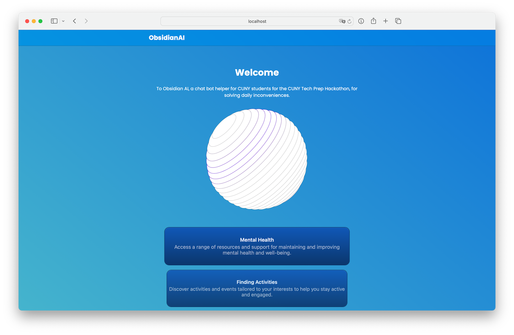

# ObsidianAI

## Description

This project is a web application that interacts with the OpenAI API to generate responses based on user input in categories of CUNY FAQ, mental health, CUNY activities and summarization. The backend is built with Node.js and Express, and the frontend is a simple HTML page.

## Prerequisites
Node.js (v14 or higher)
npm (v6 or higher)
Installation
Clone the repository:
https://github.com/bikiris/Obesidian-CTP-Hackathon.git

### Install the dependencies: npm install

Create a .env file in the root directory and add your OpenAI API key: OPENAI_API_KEY='your-api-key-here'

Running the Project
Start the backend server: node ./backend/index.js

Open index.html in your browser:

Navigate to the public directory.
Enter your message in the input field on the web page.
Click the "Send" button to get a response from the OpenAI API.
Project Structure

## How to use:

Navigate to the desired category and enter your message in the input field on the web page. Click the "Send" button to get a response from the OpenAI API.

### Project Structure
```
├── backend  
│   ├── index.js  
│   └── Service  
│       └── openaiService.js  
├── public  
│   ├── index.html  
│   ├── styles.css  
│   └── script.js  
├── .env  
├── package.json  
└── README.md 
```
### Code Description:

We integrated OpenAI API into a frontend chatbot to provide CUNY resources to students.

## Screenshots:



## Videos:

[](.github/480p.mov)


## License:
This project is licensed under Apache 2.0. See [Liscense](/LICENSE) for more details.

## Acknowledgements:

- [OpenAI](https://openai.com/) for providing the API.
- [Node.js](https://nodejs.org/en) for the backend runtime.
- [Express](https://expressjs.com/) for the web framework.

